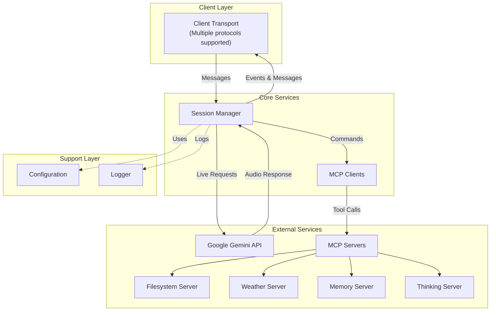
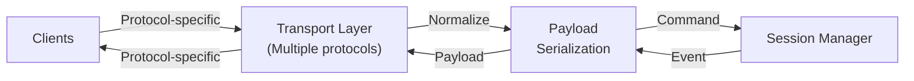
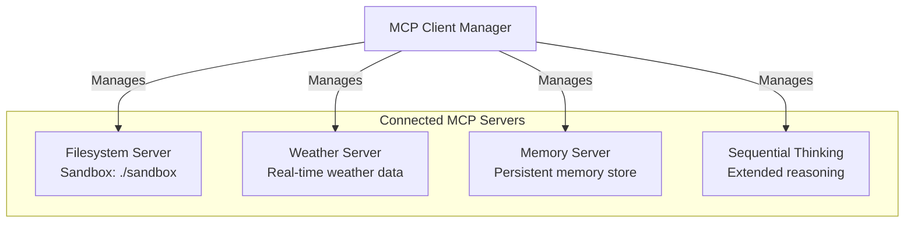
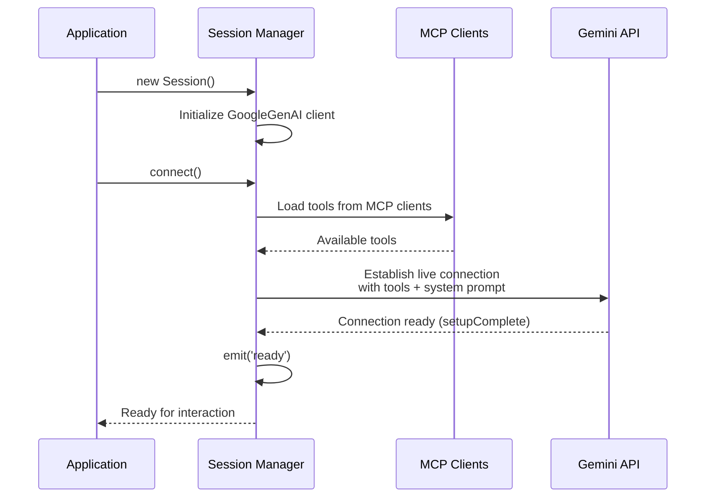
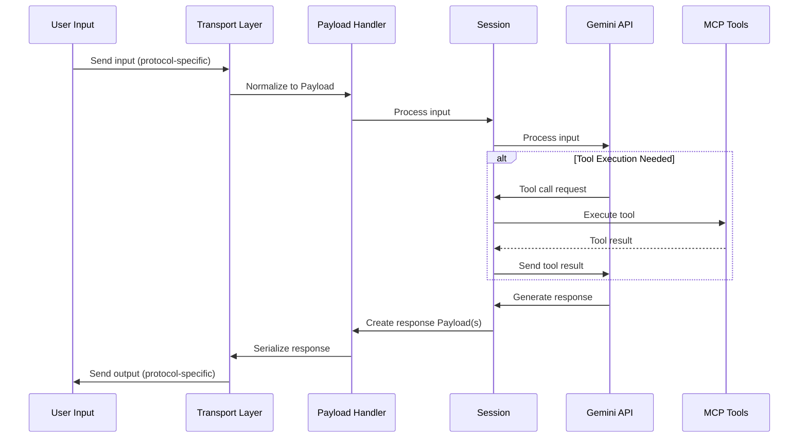
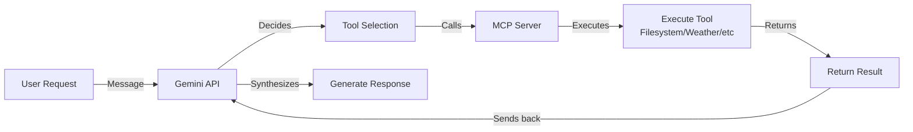
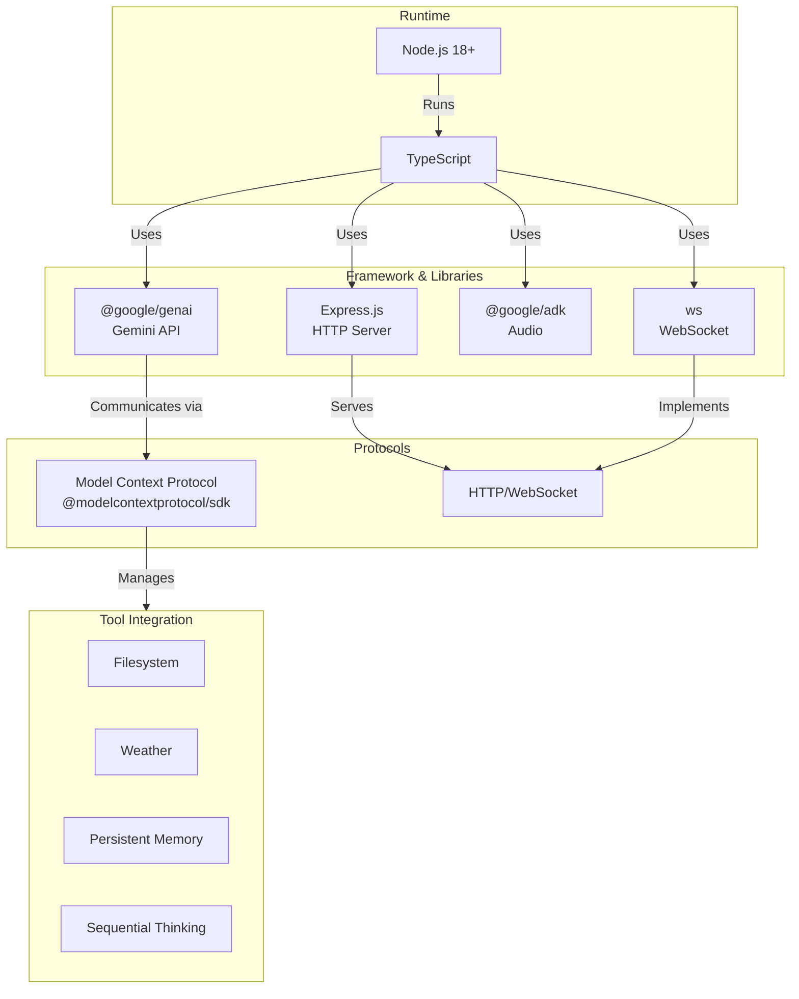

# Architecture

This document describes the overall architecture and design of cyra, including its core components, data flow, and interaction patterns.

**Related:** [Installation Guide](./Installation.md) | [Payload Standard](./Payload.md) | [Introduction](./Introduction.md)

## System Overview

cyra is built on a modular architecture that separates concerns across multiple layers:



## Core Components

### 1. Server & Transport Layer (`src/servers/`)

The server layer handles communication with clients through multiple transport protocols using a standardized [Payload format](./Payload.md):

**server.ts**
- Express HTTP server setup
- Creates the base server instance for handling client connections

**WebSocket.ts**
- WebSocket transport implementation
- Handles real-time bidirectional communication
- Serializes Session events into Payloads
- Deserializes client input into Session commands
- Message routing and client connection management

**Future Transport Protocols:**
- Socket.io support
- HTTP long-polling
- gRPC
- Custom protocols

All transport implementations must:
1. Convert incoming client data into Session commands
2. Convert Session events into standardized Payloads
3. Send Payloads to clients using their transport protocol



### 2. Session Management (`src/services/Session.ts`)

The Session class is the heart of cyra's functionality. It manages:

- **Connection Lifecycle**: Establishes and maintains connections to Google's Gemini API
- **Audio Handling**: Manages real-time audio input/output
- **Tool Execution**: Coordinates with MCP clients to execute available tools
- **Event Management**: Emits typed events for session state changes

**Key Features:**
- Loads system prompts from `prompts/system_prompt.md`
- Integrates MCP tools into Gemini's tool set
- Supports real-time audio transcription
- Includes affective dialogue and proactive audio features
- Manages multiple concurrent sessions (stored in Set)

### 3. MCP Integration (`src/services/MCPClients.ts` & `src/config/mcp.ts`)

The Model Context Protocol (MCP) integration provides extensible tool capabilities:

**Configuration** (`src/config/mcp.ts`):
- Defines MCP server configurations
- Currently loads 4 standard MCP servers via stdio transport

**Available MCP Servers:**



**MCP Client Manager** (`src/services/MCPClients.ts`):
- Initializes all configured MCP servers
- Establishes stdio transport connections
- Lists available tools from each server
- Converts MCP tools to Gemini-compatible tools

### 4. Configuration Layer (`src/config/`)

**index.ts**
- Centralized configuration management
- Loads environment variables and system settings
- Provides configuration access across the application

**mcp.ts**
- MCP server configurations (covered above)

### 5. Utility Layer (`src/utils/`)

**logger.ts**
- Structured logging with color and formatting
- Multiple log levels and output types
- Hierarchical logging for complex operations

## Data Flow

### Session Initialization Flow



### Interaction Flow



**Payload Types Used:**
- `status` - Session ready/processing state
- `audio` - Audio response data
- `text` - Text response data
- `transcription` - Transcribed input/output
- `thought` - Internal reasoning
- `turn_complete` - Interaction complete
- `error` - Error conditions

See [Payload Standard](./Payload.md) for detailed message types.

### Tool Execution Flow



## Event System

Session extends TypedEmitter and emits the following events:

- **ready**: Session is connected and ready for interaction
- **close**: Session was closed (with optional reason)
- **error**: An error occurred during the session
- **message**: A message was received (for internal handling)

See [types/SessionEvents.d.ts](../types/SessionEvents.d.ts) for the complete event type definitions.

## Storage & Persistence

- **Memory**: `sandbox/memory.jsonl` - Persistent memory store managed by MCP memory server
- **System Prompt**: `prompts/system_prompt.md` - System instructions for Gemini
- **Configuration**: Environment variables and config files
- **Payload Definitions**: [types/Payload.d.ts](../types/Payload.d.ts) - Standardized message format for all protocols

## Technology Stack



## Directory Structure

```
src/
├── index.ts                 # Entry point - starts server
├── config/
│   ├── index.ts            # Configuration management
│   └── mcp.ts              # MCP server configurations
├── servers/
│   ├── server.ts           # Express HTTP server
│   └── WebSocket.ts        # WebSocket implementation
├── services/
│   ├── Session.ts          # Core session management
│   ├── MCPClients.ts       # MCP client initialization
│   └── spawns/             # Process spawning utilities
├── utils/
│   └── logger.ts           # Logging utilities
└── types/
    ├── Payload.d.ts        # Message payload types
    └── SessionEvents.d.ts  # Session event types
```

## Extension Points

### Adding New MCP Servers

1. Add server configuration to `src/config/mcp.ts`
2. Define the stdio transport parameters
3. MCP clients will automatically connect and discover tools

### Custom Tools

Tools are exposed through MCP servers. Any MCP-compatible server can be added to provide new capabilities.

### System Prompt Customization

Modify `prompts/system_prompt.md` to change Gemini's behavior and instructions.

## Security Considerations

- Filesystem access is sandboxed to `sandbox/` directory
- Transport connections should be restricted based on your deployment
- Tool execution is mediated through MCP, allowing for granular control

## Related Documentation

- **[Introduction](./Introduction.md)** - Feature overview and getting started
- **[Installation Guide](./Installation.md)** - How to set up and run cyra
- **[Payload Standard](./Payload.md)** - Details on the message format used in interactions
