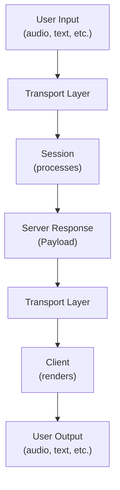

# Payload Standard

This document defines the standardized message format used for communication between the Transport Layer and the Session Manager in Cyra.

## Overview

The Payload is a typed, discriminated union that ensures type-safe communication across all transport protocols. This allows any protocol implementation (WebSocket, Socket.io, HTTP, etc.) to communicate with the Session Manager using a consistent format.

Payloads are bidirectional:
- **Client-to-Server**: Input data sent from clients to the server
- **Server-to-Client**: Responses and events emitted by the server

## Payload Structure

All payloads follow this structure:

```typescript
{
  type: PayloadType,
  payload: PayloadData
}
```

- **type**: Discriminator string that identifies the message kind
- **payload**: Protocol-specific data associated with that type

---

## Client-to-Server Payloads

These are payloads that clients can send to the server for processing.

### `audio`
Client sending audio data to the server.

```typescript
type: 'audio'
payload: {
  audio: string
}
```

**Notes:**
- Audio is encoded as base64 string
- Allows protocol-agnostic transport of binary audio data
- Server processes audio through Gemini's real-time API

---

### `text`
Client sending text input to the server.

```typescript
type: 'text'
payload: {
  text: string
}
```

**Usage:**
- Direct text input for processing
- Alternative to audio input
- Used by text-based clients

---

## Server-to-Client Payloads

These are payloads that the server emits to clients in response to processing or events.

### `status`
Server informing the client about the current state.

```typescript
type: 'status'
payload: {
  status: 'ready' | 'processing'
}
```

**Examples:**
- `ready` - Session is initialized and ready to receive input
- `processing` - Currently processing a request

---

### `error`
Server reporting an error condition.

```typescript
type: 'error'
payload: {
  code: number,
  message: string
}
```

**Examples:**
- `{ code: 500, message: "Internal Server Error" }`
- `{ code: 1001, message: "Session disconnected" }`

---

### `audio`
Server sending audio data to the client.

```typescript
type: 'audio'
payload: {
  audio: string
}
```

**Notes:**
- Audio is encoded as base64 string
- Allows protocol-agnostic transport of binary audio data
- Clients implement their own audio playback strategy

---

### `text`
Server sending text response to the client.

```typescript
type: 'text'
payload: {
  text: string
}
```

**Usage:**
- Direct text responses from Gemini
- Fallback when audio is not available
- Useful for text-based clients

---
Server sharing internal reasoning/thinking from Gemini.

```typescript
type: 'thought'
payload: {
  thought: string
}
```

**Notes:**
- Provides transparency into AI decision-making
- Useful for debugging and understanding model behavior
- Only sent if `thinkingConfig.includeThoughts` is enabled in the Session

---

### `transcription`
Server sending transcribed text from processed input.

```typescript
type: 'transcription'
payload: {
  transcription: string,
  type: 'input' | 'output',
  finished?: boolean
}
```

**Fields:**
- `transcription`: The transcribed text
- `type`: Whether this is transcription of input (`'input'`) or output (`'output'`)
- `finished`: Optional boolean indicating if transcription is complete (useful for streaming)

**Examples:**
- Input transcription: `{ transcription: "What's the weather?", type: 'input', finished: true }`
- Output transcription (streaming): `{ transcription: "The weather is", type: 'output', finished: false }`

---

### `turn_complete`
Server indicating that the current turn/interaction is complete.

```typescript
type: 'turn_complete'
payload: {} // Empty object
```

**Usage:**
- Signals end of a request-response cycle
- Used to manage conversation turns
- Helps clients know when to expect new input

---

### `interrupted`
Server indicating that processing was interrupted.

```typescript
type: 'interrupted'
payload: {} // Empty object
```

**Scenarios:**
- User interrupted the response
- Session was forcibly closed
- Resource limits reached

---

### `function_call`
Server indicating a tool/function is being executed.

```typescript
type: 'function_call'
payload: {} // Reserved for future expansion
```

**Notes:**
- Currently has empty payload
- Reserved for detailed function call information
- May include function name, arguments, and results in future versions

---

## Implementation Guide

### For Transport Implementations

Transport implementations should:

1. **Receive messages** from the Transport Layer
2. **Parse the type** field to identify message kind
3. **Handle the payload** according to type
4. **Send user input** to the Session Manager in a normalized format

Example WebSocket handler:
```typescript
ws.on('message', (data) => {
	const message = JSON.parse(data.toString());

	switch (message.type) {
		case 'audio':
			session.handleAudioInput(message.payload.audio);
			break;
		case 'text':
			session.handleTextInput(message.payload.text);
			break;
		// Handle other types as needed
		default:
			console.error(`Unknown payload type: ${message.type}`);
	}
});
```

### For Client Implementations

Client implementations should:

1. **Receive input** from the user (audio, text, etc.)
2. **Send to transport** in whatever format the transport expects
3. **Listen for payloads** from the transport layer
4. **Handle each type** appropriately (play audio, display text, etc.)
5. **No dependency on specific payload format** - handle gracefully

Example client flow:



## Type Safety

TypeScript type definitions:

```typescript
// Client-to-Server Payloads
interface ClientPayloadMap {
	audio: { audio: string };
	text: { text: string };
};

// Server-to-Client Payloads
interface ServerPayloadMap {
	status: { status: 'ready' | 'processing' };
	error: { code: number; message: string };
	audio: { audio: string };
	text: { text: string };
	thought: { thought: string };
	transcription: {
		transcription: string;
		type: 'input' | 'output';
		finished?: boolean;
	};
	turn_complete: Record<string, never>;
	interrupted: Record<string, never>;
	function_call: {};
};

// Combined for internal use
export interface PayloadMap extends ClientPayloadMap, ServerPayloadMap { }

type Payload<K extends keyof PayloadMap = keyof PayloadMap> = {
	[T in K]: {
		type: T;
		payload: PayloadMap[T];
	};
}[K];

export type ClientPayload = Payload<keyof ClientPayloadMap>;
export type ServerPayload = Payload<keyof ServerPayloadMap>;

export default Payload;
```

This ensures that:
- Only valid types can be created
- Payloads cannot have mismatched types and data
- IDEs provide full autocomplete for payload structure
- Client and server payloads are properly separated

## Protocol Agnosticism

The Payload standard is intentionally:

- **Protocol-agnostic**: Works with WebSocket, Socket.io, HTTP, gRPC, etc.
- **Client-agnostic**: Doesn't specify how clients render/process content
- **Modality-agnostic**: Can transport audio or text seamlessly
- **Extensible**: New types can be added to `PayloadMap` without breaking existing code

## Future Extensions

To add new message types:

1. Add entry to `PayloadMap` interface:
   ```typescript
   newType: { someField: string };
   ```

2. Update Session to emit the new payload type
3. Transport implementations automatically handle it
4. Clients can opt-in to handling the new type

## Examples

### Client-to-Server

**Text Input**
```json
{
  "type": "text",
  "payload": { "text": "What is the weather today?" }
}
```

**Audio Input**
```json
{
  "type": "audio",
  "payload": { "audio": "//NExAAVkAP..." }
}
```

---

### Server-to-Client

**Server Ready**
```json
{
  "type": "status",
  "payload": { "status": "ready" }
}
```

**Error Response**
```json
{
  "type": "error",
  "payload": { "code": 500, "message": "Failed to connect to Gemini API" }
}
```

**Audio Response**
```json
{
  "type": "audio",
  "payload": { "audio": "//NExAAVkAP..." }
}
```

**Text Response**
```json
{
  "type": "text",
  "payload": { "text": "The weather today is sunny." }
}
```

**Thought Stream**
```json
{
  "type": "thought",
  "payload": { "thought": "The user asked about weather, I should use the weather tool." }
}
```

**Input Transcription**
```json
{
  "type": "transcription",
  "payload": {
    "transcription": "What is the weather today?",
    "type": "input",
    "finished": true
  }
}
```

**Turn Complete**
```json
{
  "type": "turn_complete",
  "payload": {}
}
```
